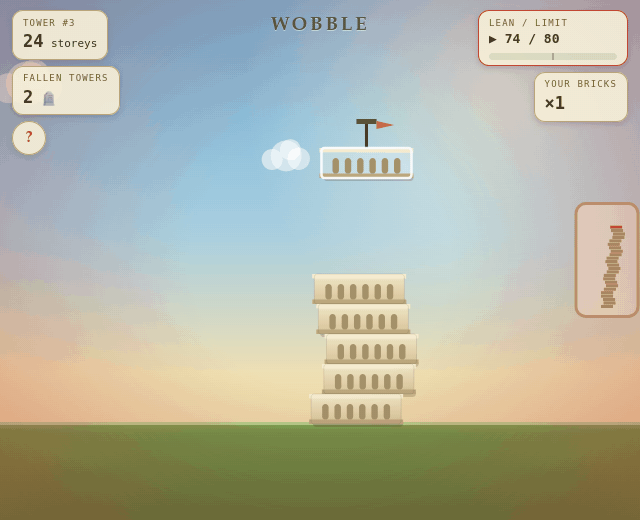

# WOBBLE 🏛

**One tower for the whole subreddit. One tap. Don't be the one who topples it.**

### ▶ [Play the live tower](https://www.reddit.com/r/WobbleTower/comments/1ux6wv4/wobble_one_tower_for_the_whole_subreddit_dont_be/)



## The tower

One post is one tower, shared by the whole subreddit. Tap **BUILD**, a storey slides across the top, and you tap again to drop it - land it centered, or tilt the tower a little closer to collapse. Your name is carved on every storey you place, for as long as the tower stands.

Miss too much and the whole thing comes down for everyone - and the game posts a memorial that **names whoever dropped the fatal storey**. Then a fresh tower rises, and it starts again.

## Why you'll come back

- **One shared thing to care about.** The tower grows while you're away - is your storey still standing? Is it load-bearing now?
- **Real stakes.** No lone griefer can knock it down: a fresh tower survives any single bad drop. But two sloppy builders on a tall tower? That's a funeral.
- **Failure is the best content.** Every collapse becomes a memorial post with the height, the top builders, and the culprit - the whole sub comes back to see who did it.
- **Bricks regrow through the day** (one every 3 hours), so there's always a reason to check back. Practice mode is free anytime.
- **Skill matters.** The slide speeds up as the tower grows, and a steady hand can even *straighten* a leaning tower - heroes get remembered too.

## Add to your community

Hit **Add to community** on the [app page](https://developers.reddit.com/apps/wobbletower), then use the subreddit menu → **"WOBBLE: create tower post"**. That's the entire setup - one post is all it takes, and new towers and memorials are posted automatically. The game runs inside the post; no login is needed to try it.

## Under the hood

- **Devvit Web** + Express + Redis, running entirely inside a Reddit post.
- **Server-authoritative:** every drop is validated and clamped on the server, which enforces both anti-cheat and anti-grief (a fresh tower can never be toppled by a single storey - unit-tested).
- **One shared state, no physics-sync nightmare:** the tower's tilt is a single *deterministic number*, so every device agrees on the exact state and the exact culprit; real physics is used only for the cosmetic collapse animation, recorded once and replayed.
- **Fair turns:** one builder at a time via an atomic Redis `SET NX` lock, with a "you're next" queue.
- Unit tests cover the tilt math and the game core.

## For developers

<details>
<summary>Run it locally / test</summary>

```bash
# No dependencies needed to run the game logic locally:
node local/server.mjs          # → http://localhost:8571
#   /?u=alice and /?u=bob in two tabs = two players (no ?u = logged out)

node --test                    # tilt-math + game-core unit tests

# Deploy (Node 22 + a logged-in devvit CLI):
npm run build && npx devvit upload && npx devvit install <subreddit>
```

Layout: `src/shared/` - config + tilt math (shared by client & server) · `src/server/` - GameCore over Redis · `src/client/` - the webview · `local/` - the dev server (not shipped).
</details>

## What's next: Tower Wars ⚔️

Every community already has its own tower - next, we let them race. **Subreddit vs subreddit seasons** ("r/A 47 : 52 r/B" right on the cover), a **global hall of fame** for the tallest standing tower and the loudest collapse of the week, and **raid memorials** that name the attacker and their home subreddit. The plumbing is already there: one tower per installation + Devvit's app-global Redis.

*(Internal roadmap with research, scoring and gates: [docs/15-tower-wars-roadmap.md](docs/15-tower-wars-roadmap.md). Code frozen until judging ends July 27.)*

---

Built for Reddit's **Games with a Hook** hackathon on Devvit Web - one shared tower, playable right inside a Reddit post.
▶ **Play:** [r/WobbleTower](https://www.reddit.com/r/WobbleTower/comments/1ux6wv4/wobble_one_tower_for_the_whole_subreddit_dont_be/)
